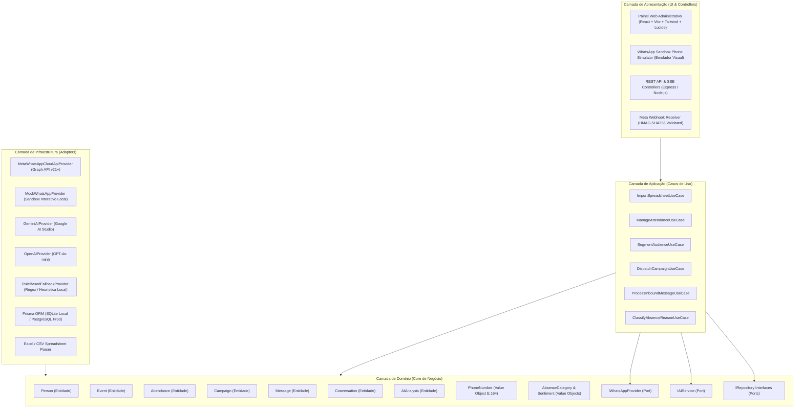
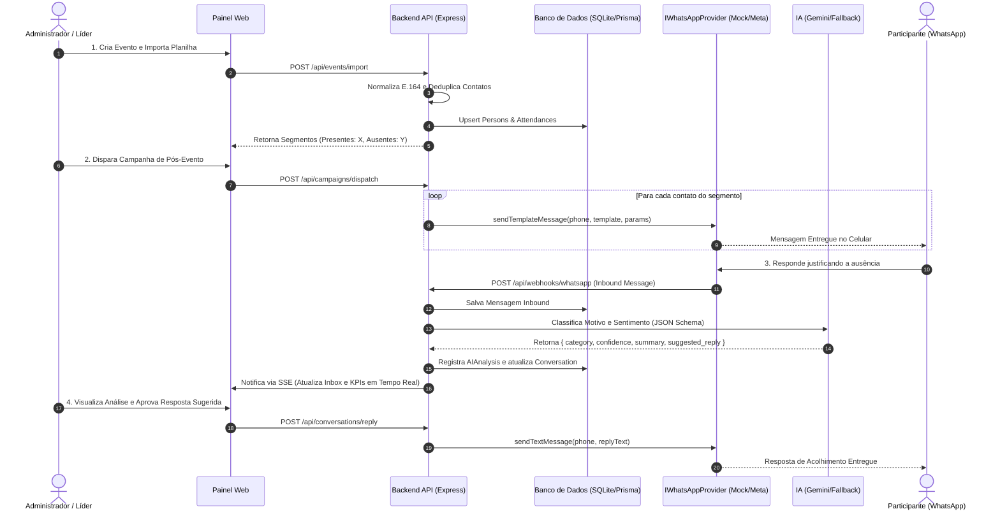

# Arquitetura do Sistema — Conecta WhatsApp CRM (MVP)

## 1. Visão Geral e Princípios Arquiteturais

O **Conecta WhatsApp CRM** é uma plataforma inteligente e modular de relacionamento, gestão de presença comunitária e automação de pós-evento via WhatsApp com interpretação de respostas por Inteligência Artificial.

A arquitetura foi projetada sob os princípios de:
- **Clean Architecture & Ports and Adapters (Hexagonal)**: Isolamento total entre as regras de negócio de domínio e integrações externas (WhatsApp, Provedores de IA, Banco de Dados, Parsers).
- **Modular Monolith**: Uma única base de código coesa, fortemente tipada em TypeScript, que evita a complexidade operacional desnecessária de microsserviços no estágio de MVP, mantendo fronteiras modulares estritas para futura extração.
- **Resiliência e Continuidade Operacional**: Disponibilidade de múltiplos provedores com fallback automático (ex: Google Gemini -> OpenAI -> Rule-based Heuristics; Meta Cloud API -> High-Fidelity Mock Sandbox).
- **Segurança e Privacidade por Design (LGPD-First)**: Rastreabilidade por auditoria, validação criptográfica de webhooks (HMAC SHA-256), proteção de PII e consentimento com opt-out imediato.



---

## 2. Divisão de Camadas e Responsabilidades

### 2.1 Domain Layer (`src/domain/`)
- **Agnóstica a Frameworks**: Não possui dependências de Express, Prisma, Meta ou Google.
- **Entidades**: `Person`, `Event`, `Attendance`, `Campaign`, `Message`, `Conversation`, `AIAnalysis`, `User`, `AuditLog`.
- **Value Objects**:
  - `PhoneNumber`: Validação e normalização estrita de números no padrão internacional E.164 (`+55DD9XXXXXXXX`), com correção de 9º dígito e rejeição de fixos inválidos.
  - `AbsenceCategory`: Enum padronizado de 12 categorias de ausência.
  - `Sentiment`: Enum (`POSITIVO`, `NEUTRO`, `NEGATIVO`, `PREOCUPADO`).
- **Ports (Interfaces)**:
  - `IWhatsAppProvider`: Contrato para envio de templates, texto livre, handshake e parsing de webhooks.
  - `IAIService`: Contrato para classificação estruturada e sugestão de resposta.
  - `IRepositories`: Contratos de persistência para cada entidade.

### 2.2 Application Layer (`src/application/`)
- Orquestra os fluxos de casos de uso do sistema.
- Valida entradas com schemas **Zod**.
- Implementa regras de idempotência, deduplicação de contatos e transições de status.
- Gerencia o rate limiting e filas de disparo em memória controladas.

### 2.3 Infrastructure Layer (`src/infrastructure/`)
- **WhatsApp Adapters**:
  - `MetaWhatsAppCloudApiProvider`: Comunicação real com a Graph API da Meta, validação HMAC-SHA256 e parsing de eventos.
  - `MockWhatsAppProvider`: Simulador local em memória com disparos assíncronos de eventos SSE para o emulador visual no painel.
- **AI Adapters**:
  - `GeminiAIProvider`: Integração com Gemini 2.0 / 2.5 Flash usando structured output nativo.
  - `OpenAIProvider`: Fallback secundário para GPT-4o-mini com structured outputs estritos.
  - `RuleBasedFallbackProvider`: Fallback local instantâneo baseado em 6 conjuntos de expressões regulares e árvore léxica (100% offline, zero dependências externas).
- **Database Adapter**:
  - Prisma ORM configurado com SQLite para execução local instantânea (zero setup de containers no Windows/Linux/Mac), facilmente chaveável para PostgreSQL em produção via variável `DATABASE_URL`.
- **File Parsing**:
  - Leitor universal de planilhas CSV e XLSX com suporte a detecção flexível de colunas (Nome, Telefone, Evento, Presença).

### 2.4 Presentation Layer (`src/presentation/` & `src/client/`)
- **API REST**: Rotas HTTP limpas para gerenciamento de eventos, contatos, campanhas, histórico e logs.
- **Server-Sent Events (SSE)**: Canal unidirecional em tempo real para streaming de logs, status de disparo e mensagens recebidas do Sandbox.
- **Frontend Dashboard**: SPA moderno construído com React, Vite, Tailwind CSS e Lucide Icons, incluindo:
  - Dashboard de Métricas com KPIs de presença e engajamento.
  - Módulo de Eventos & Importador Inteligente com pré-visualização.
  - Central de Campanhas e Segmentação (Presentes vs Ausentes).
  - Central de Conversas & Insights de IA com níveis Human-in-the-Loop.
  - Emulador Visual de Smartphone WhatsApp Sandbox integrado.

---

## 3. Fluxo de Dados Ponta a Ponta



---

## 4. Estrutura de Diretórios do Projeto

```
whatsapp-crm-mvp/
├── docs/                      # Documentação Técnica e Arquitetural
│   ├── architecture.md
│   ├── technology-research.md
│   ├── whatsapp-research.md
│   ├── ai-strategy.md
│   ├── database-design.md
│   ├── security.md
│   ├── mvp-scope.md
│   ├── roadmap.md
│   └── decisions.md
├── prisma/                    # Modelagem e Migrações do Banco
│   └── schema.prisma
├── src/
│   ├── domain/                # Entidades, Value Objects, Ports
│   │   ├── entities/
│   │   ├── value-objects/
│   │   ├── ports/
│   │   └── errors/
│   ├── application/           # Casos de Uso e DTOs
│   │   ├── use-cases/
│   │   └── dtos/
│   ├── infrastructure/        # Implementações Concretas (Adapters)
│   │   ├── database/
│   │   ├── whatsapp/
│   │   ├── ai/
│   │   └── parsers/
│   ├── presentation/          # Controllers, Rotas e Servidor HTTP
│   │   ├── controllers/
│   │   ├── routes/
│   │   └── server.ts
│   └── client/                # Frontend React + Vite + Tailwind Dashboard
│       ├── src/
│       │   ├── components/
│       │   ├── pages/
│       │   └── services/
│       ├── index.html
│       ├── package.json
│       └── vite.config.ts
├── tests/                     # Suíte de Testes Automatizados (Unit & E2E)
│   ├── unit/
│   └── scenarios/
├── .env.example
├── package.json
├── tsconfig.json
└── README.md
```
