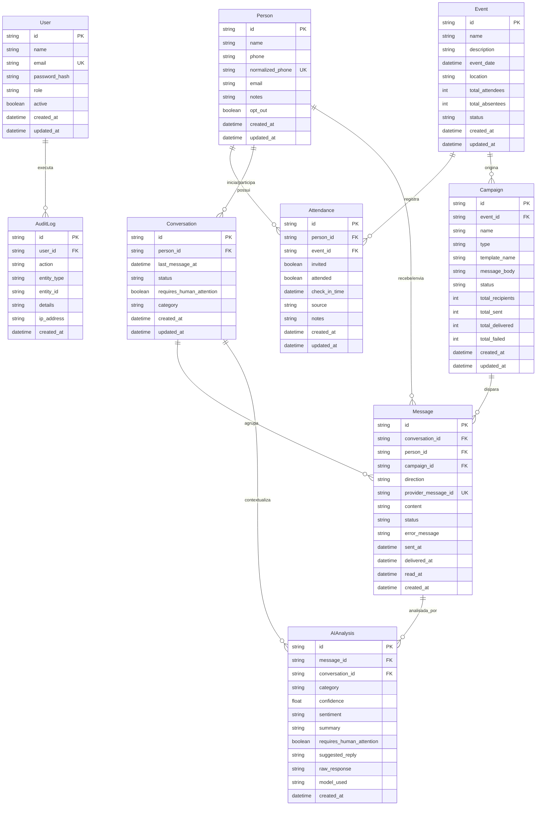

# Modelagem de Dados e Arquitetura de Persistência

## 1. Visão Geral

O esquema de dados foi projetado para garantir:
1. **Integridade Referencial Estrita**: Relações claras entre Pessoas, Eventos, Presenças, Campanhas, Conversas e Análises de IA.
2. **Deduplicação Determinística**: Chave única de negócio baseada no telefone normalizado em formato internacional E.164 (`normalized_phone`).
3. **Histórico Completo e Imutável**: Trilha de mensagens trocadas e auditoria de ações do sistema.
4. **Portabilidade de Banco de Dados**: Modelado via **Prisma ORM**, permitindo execução local em SQLite sem instalação de serviços adicionais no Windows/Linux/Mac, e migração transparente para PostgreSQL em ambiente de produção via variável `DATABASE_URL`.

---

## 2. Diagrama Entidade-Relacionamento (ERD)



---

## 3. Especificação do Schema Prisma

```prisma
datasource db {
  provider = "sqlite"
  url      = env("DATABASE_URL")
}

generator client {
  provider = "prisma-client-js"
}

model User {
  id           String     @id @default(uuid())
  name         String
  email        String     @unique
  passwordHash String
  role         String     @default("ADMIN") // ADMIN, OPERATOR, VIEWER
  active       Boolean    @default(true)
  createdAt    DateTime   @default(now())
  updatedAt    DateTime   @updatedAt
  auditLogs    AuditLog[]
}

model Person {
  id              String         @id @default(uuid())
  name            String
  phone           String
  normalizedPhone String         @unique // Formato E.164: +5511999999999
  email           String?
  notes           String?
  optOut          Boolean        @default(false)
  optOutAt        DateTime?
  createdAt       DateTime       @default(now())
  updatedAt       DateTime       @updatedAt

  attendances     Attendance[]
  conversations   Conversation[]
  messages        Message[]

  @@index([normalizedPhone])
  @@index([optOut])
}

model Event {
  id              String       @id @default(uuid())
  name            String
  description     String?
  eventDate       DateTime
  location        String?
  totalAttendees  Int          @default(0)
  totalAbsentees  Int          @default(0)
  status          String       @default("COMPLETED") // DRAFT, IN_PROGRESS, COMPLETED
  createdAt       DateTime     @default(now())
  updatedAt       DateTime     @updatedAt

  attendances     Attendance[]
  campaigns       Campaign[]
}

model Attendance {
  id          String    @id @default(uuid())
  personId    String
  eventId     String
  invited     Boolean   @default(true)
  attended    Boolean   @default(false)
  checkInTime DateTime?
  source      String    @default("CSV_IMPORT")
  notes       String?
  createdAt   DateTime  @default(now())
  updatedAt   DateTime  @updatedAt

  person      Person    @relation(fields: [personId], references: [id], onDelete: Cascade)
  event       Event     @relation(fields: [eventId], references: [id], onDelete: Cascade)

  @@unique([personId, eventId])
  @@index([eventId, attended])
}

model Campaign {
  id              String    @id @default(uuid())
  eventId         String
  name            String
  type            String    // PRESENTE_FOLLOWUP, AUSENTE_FOLLOWUP
  templateName    String?
  messageBody     String
  status          String    @default("DRAFT") // DRAFT, RUNNING, COMPLETED
  totalRecipients Int       @default(0)
  totalSent       Int       @default(0)
  totalDelivered  Int       @default(0)
  totalFailed     Int       @default(0)
  createdAt       DateTime  @default(now())
  updatedAt       DateTime  @updatedAt

  event           Event     @relation(fields: [eventId], references: [id], onDelete: Cascade)
  messages        Message[]
}

model Conversation {
  id                     String       @id @default(uuid())
  personId               String
  lastMessageAt          DateTime     @default(now())
  status                 String       @default("OPEN") // OPEN, WAITING_REPLY, REPLIED, CLOSED
  requiresHumanAttention Boolean      @default(false)
  category               String?
  createdAt              DateTime     @default(now())
  updatedAt              DateTime     @updatedAt

  person                 Person       @relation(fields: [personId], references: [id], onDelete: Cascade)
  messages               Message[]
  aiAnalyses             AIAnalysis[]

  @@index([personId])
  @@index([requiresHumanAttention])
}

model Message {
  id                String       @id @default(uuid())
  conversationId    String
  personId          String
  campaignId        String?
  direction         String       // OUTBOUND, INBOUND
  providerMessageId String?      @unique
  content           String
  status            String       @default("QUEUED") // QUEUED, SENT, DELIVERED, READ, FAILED
  errorMessage      String?
  sentAt            DateTime?
  deliveredAt       DateTime?
  readAt            DateTime?
  createdAt         DateTime     @default(now())

  conversation      Conversation @relation(fields: [conversationId], references: [id], onDelete: Cascade)
  person            Person       @relation(fields: [personId], references: [id], onDelete: Cascade)
  campaign          Campaign?    @relation(fields: [campaignId], references: [id], onDelete: SetNull)
  aiAnalyses        AIAnalysis[]

  @@index([conversationId])
  @@index([personId])
  @@index([status])
}

model AIAnalysis {
  id                     String       @id @default(uuid())
  messageId              String
  conversationId         String
  category               String
  confidence             Float
  sentiment              String
  summary                String
  requiresHumanAttention Boolean      @default(false)
  suggestedReply         String?
  rawResponse            String       @default("{}")
  modelUsed              String
  createdAt              DateTime     @default(now())

  message                Message      @relation(fields: [messageId], references: [id], onDelete: Cascade)
  conversation           Conversation @relation(fields: [conversationId], references: [id], onDelete: Cascade)

  @@index([messageId])
  @@index([conversationId])
  @@index([category])
}

model AuditLog {
  id         String   @id @default(uuid())
  userId     String?
  action     String
  entityType String
  entityId   String?
  details    String   @default("{}")
  ipAddress  String?
  createdAt  DateTime @default(now())

  user       User?    @relation(fields: [userId], references: [id], onDelete: SetNull)

  @@index([action])
  @@index([createdAt])
}
```

---

## 4. Regras de Deduplicação e Importação Idempotente

1. **Chave de Negócio**: O telefone do participante é sanitizado e normalizado para o formato E.164 (`+5511999999999`).
2. **Upsert de Pessoas**: Se o telefone já existir na base, atualiza os dados complementares (ex: nome mais completo ou e-mail), mantendo estritamente preservado o status de `opt_out`.
3. **Associação ao Evento**: Cria ou atualiza o registro na tabela `Attendance` (`UNIQUE(person_id, event_id)`), permitindo re-importações seguras sem duplicar pessoas ou presenças.
