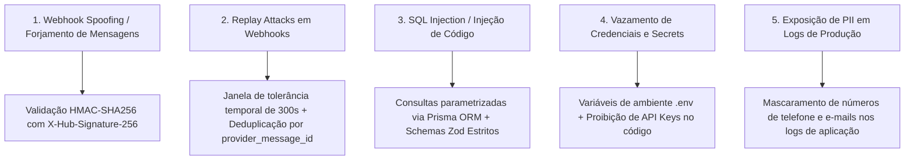

# Segurança, Privacidade e Conformidade LGPD (Lei 13.709/2018)

## 1. Princípios de Privacidade por Design (LGPD)

O **Conecta WhatsApp CRM** foi projetado desde a fundação para atender aos princípios da Lei Geral de Proteção de Dados Pessoais (LGPD):

1. **Finalidade e Necessidade**: Coleta apenas os dados indispensáveis para o relacionamento e acompanhamento pós-evento (`name`, `phone`, `email`, presença no evento).
2. **Livre Acesso e Transparência**: O titular pode consultar seu histórico e solicitar alteração ou exclusão de dados a qualquer momento.
3. **Gestão Rigorosa de Consentimento (Opt-Out Automatizado)**:
   - Qualquer participante pode revogar o consentimento de envio enviando as palavras-chave `SAIR`, `STOP`, `PARAR`, `CANCELAR` ou `DESCADASTRAR`.
   - O sistema desativa o envio instantaneamente no banco (`opt_out = true`), registra a ação no log de auditoria e impede qualquer disparo futuro de campanhas para o número.

---

## 2. Threat Model & Contramedidas de Segurança



### 2.1 Validação Criptográfica de Webhooks
```typescript
import crypto from 'crypto';

export function verifyMetaSignature(rawBody: Buffer, signatureHeader: string | undefined, appSecret: string): boolean {
  if (!signatureHeader || !signatureHeader.startsWith('sha256=')) return false;
  const hash = signatureHeader.substring(7);
  const expectedHash = crypto.createHmac('sha256', appSecret).update(rawBody).digest('hex');
  
  const a = Buffer.from(hash, 'utf8');
  const b = Buffer.from(expectedHash, 'utf8');
  if (a.length !== b.length) return false;
  return crypto.timingSafeEqual(a, b);
}
```

### 2.2 Política de Proteção de Segredos
- O arquivo `.env` nunca é versionado no Git (`.gitignore` obrigatório).
- O arquivo `.env.example` fornece o catálogo completo de variáveis necessárias sem expor valores confidenciais.
- Senhas administrativas são armazenadas com hash criptográfico seguro (bcrypt / Argon2id).

---

## 3. Trilha de Auditoria Imutável (`AuditLog`)

Todas as operações sensíveis do sistema são registradas na tabela `AuditLog`:
- Importação de listas de presença em lote (`PERSON_IMPORT_BATCH`).
- Disparo de campanhas pós-evento (`CAMPAIGN_DISPATCHED`).
- Processamento automático de descadastro (`OPT_OUT_PROCESSED`).
- Respostas manuais ou aprovadas por operadores humanos (`HUMAN_REPLY_SENT`).
- Acessos administrativos e tentativas de login.
