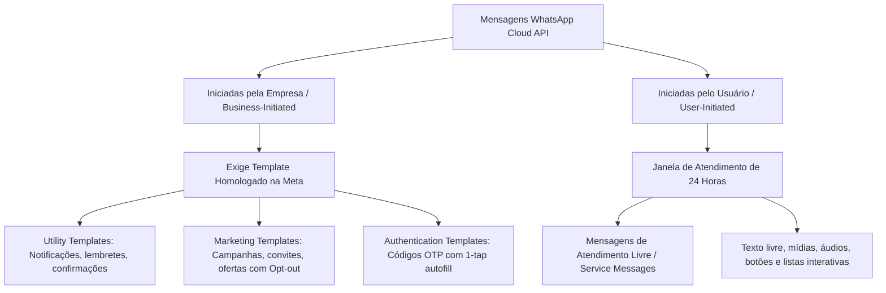

# Pesquisa Técnica Oficial: WhatsApp Business Cloud API & Mock Sandbox (2026)

## 1. Arquitetura da WhatsApp Cloud API (Meta Graph API v21+)

A **WhatsApp Business Platform (Cloud API)** é a infraestrutura oficial da Meta para comunicação empresarial direta e programática.

### 1.1 Modelo de Mensagens da Meta



### 1.2 Regra da Janela de 24 Horas (Customer Care Window)
- **Disparo de Mensagens de Pós-Evento (Campanha Inicial)**: Como o contato inicial pós-evento é iniciado pela igreja/organização (*Business-Initiated*), ele **obrigatoriamente deve utilizar um Template pré-aprovado pela Meta** (ex: template `pos_evento_presente` e `pos_evento_ausente`).
- **Respostas Recebidas**: Quando o membro responde ao template no WhatsApp, a Meta abre imediatamente uma **janela de 24 horas de atendimento gratuito**.
- **Durante a Janela**: O sistema ou operador humano pode enviar mensagens em formato livre (texto humanizado, áudio, links de oração) sem restrição de template.
- **Após 24h sem nova mensagem**: A janela se encerra. Qualquer tentativa de envio de texto livre retornará o erro oficial `(#131047) Message failed to send because more than 24 hours have passed`. O contato só pode ser reestabelecido enviando um novo template.

---

## 2. Precificação Atualizada (Modelo 2025/2026 - Per Message Delivered)

Desde 1º de julho de 2025, a Meta aboliu a cobrança por conversas de 24h em bloco e cobra individualmente por **mensagem entregue por categoria**:

| Categoria | Janela Fechada (Empresa Inicia) | Janela Aberta (< 24h de resposta do usuário) |
| :--- | :--- | :--- |
| **Utility Template** | Tarifado por entrega (~$0.015 - $0.035 dependendo da região) | Gratuito |
| **Marketing Template** | Tarifado por entrega (~$0.050 - $0.080) | Tarifado por entrega |
| **Service Message (Texto Livre)** | Bloqueado por política da Meta | Gratuito |

*(A partir de outubro de 2026, a Meta introduz tarifação granular para mensagens de serviço excedentes; para volumes de igrejas e eventos locais com centenas a poucos milhares de contatos, o custo permanece na casa de poucos reais por evento).*

---

## 3. Segurança de Webhooks (HMAC SHA-256 e Verificação)

A Meta envia eventos de mensagens e status via Webhooks HTTPS. O sistema implementa duas camadas estritas de segurança:

1. **Handshake de Verificação (GET)**:
   ```typescript
   // GET /api/webhooks/whatsapp?hub.mode=subscribe&hub.verify_token=XYZ&hub.challenge=123
   if (mode === 'subscribe' && token === process.env.META_WEBHOOK_VERIFY_TOKEN) {
     return res.status(200).send(challenge);
   }
   ```
2. **Validação Criptográfica de Assinatura (POST)**:
   - Toda requisição recebida contém o cabeçalho `X-Hub-Signature-256: sha256=<hash_hex>`.
   - O backend valida a assinatura utilizando `crypto.createHmac('sha256', META_APP_SECRET)` sobre o `req.rawBody` bruto.
   - Utiliza `crypto.timingSafeEqual` para prevenir ataques de temporização (*Timing Attacks*).

---

## 4. Políticas de Opt-In e Opt-Out Automatizado (STOP / SAIR)

Conforme as políticas globais da Meta e a LGPD (Lei 13.709/2018):
- Toda campanha permite descadastramento imediato.
- O sistema monitora palavras-chave de supressão: `SAIR`, `STOP`, `PARAR`, `CANCELAR`, `DESCADASTRAR`, `NÃO QUERO MAIS`.
- Ao identificar essas palavras-chave:
  1. A flag `opt_out = true` é persistida no banco imediatamente.
  2. Um log de auditoria `OPT_OUT_PROCESSED` é registrado.
  3. Uma mensagem de confirmação de descadastramento é enviada ao usuário.
  4. O número é bloqueado em todos os disparos futuros de campanhas.

---

## 5. Limitações Críticas & Anti-Patterns Evitados

### 5.1 Grupos vs Comunicação 1:1
- A WhatsApp Cloud API oficial **não oferece suporte para automação em grupos de usuários**.
- O envio é arquitetado no formato **1:1 direto e personalizado**, garantindo privacidade individual dos motivos de ausência (ex: problemas familiares ou de saúde não devem ser expostos publicamente em grupos).

### 5.2 Soluções Não-Oficiais (Scraping de WhatsApp Web)
- **Riscos Reais**: Banimento sumário do número de telefone pela Meta, vulnerabilidade a alterações diárias no DOM do WhatsApp Web, indisponibilidade constante e violação dos termos de serviço da Meta.
- **Decisão Arquitetural**: Uso exclusivo da **WhatsApp Cloud API oficial**, complementada por um **Mock Sandbox Provider** completo para desenvolvimento local e testes.

---

## 6. Design do Mock/Sandbox Provider

O `MockWhatsAppProvider` implementa fielmente o contrato `IWhatsAppProvider`:
- **Simulador Interativo**: Permite testar todo o fluxo pelo painel administrativo (disparo de campanha, simulação de entrega, simulação de leitura e resposta do usuário).
- **Emulador Visual de Celular**: Interface responsiva no dashboard que exibe as mensagens recebidas e permite digitar respostas em tempo real.
- **Eventos em Tempo Real**: Notifica o frontend instantaneamente via Server-Sent Events (SSE) sem necessidade de polling.
- **Zero Custo & Zero Fricção**: Permite rodar o projeto do início ao fim em qualquer máquina local sem necessidade de criar conta no Meta Business Manager no primeiro minuto.
